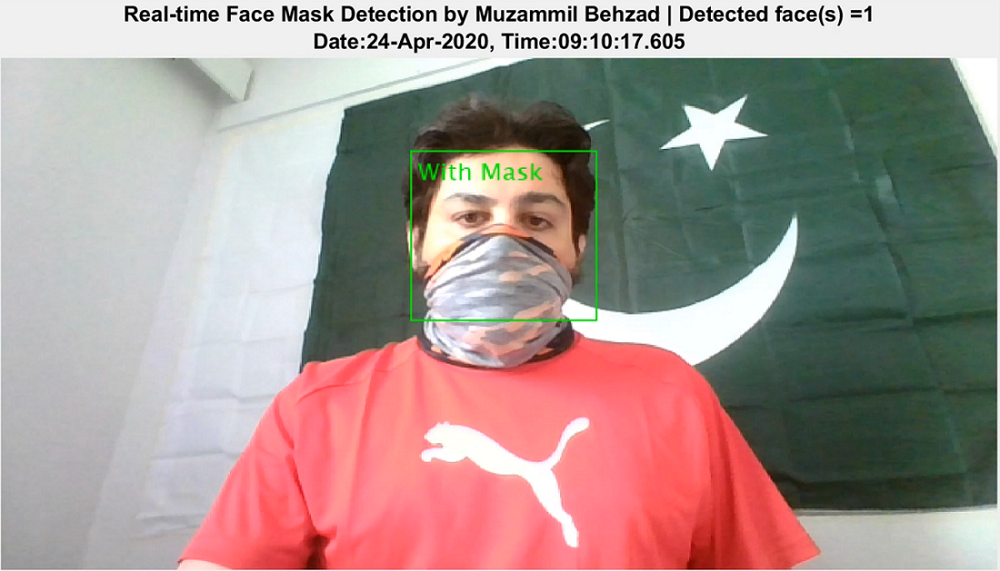

# FaceMaskDetection
To further help combat the corona virus (COVID-19), this repository can be used for real-time face mask detection using webcam with an impressive accuracy. For convenience, the source codes are shared both in MATLAB and Python.

Dataset link: https://drive.google.com/open?id=1hcsUK9Jp8q-In5z9g9Dm3uPRR9atZEq2

Live demo here: https://youtu.be/OJcLjZILWjM

